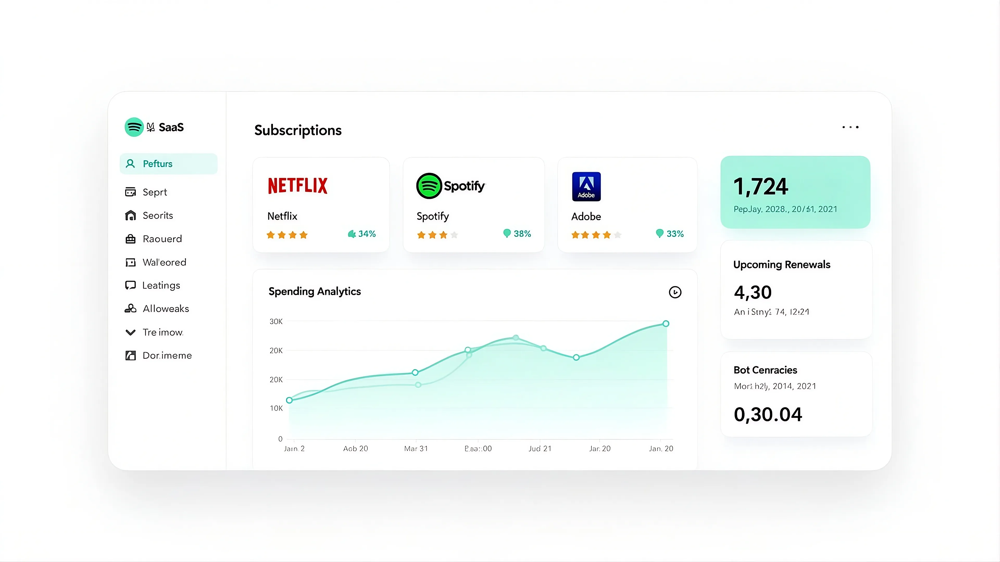

# Subscription Management System



A production-ready full-stack Subscription Management application that seamlessly pairs a robust **Node.js/Express backend API** and a modern **React frontend**. The system handles user authentication, automated subscriptions, database management, and business logic with an interactive and highly responsive UI.

---

## ⚙️ Tech Stack

### Frontend
- **React** & **TypeScript**
- **Vite**
- **Tailwind CSS**
- **shadcn-ui**

### Backend
- **Node.js** & **Express.js**
- **MongoDB** & **Mongoose**
- **Arcjet** (Rate Limiting & Bot Protection)
- **Upstash / QStash** (Email Reminders & Automated Workflows)

---

## 🔋 Features

- **Full-stack Integration**: Smooth communication between the React-based client and the Express-based API.
- **Authentication**: JWT-based authentication for users and subscription management.
- **Modern UI**: Clean, engaging, and responsive interfaces built seamlessly using Tailwind CSS and shadcn/ui components.
- **Security & Reliability**: Built-in rate limiting and bot protection using Arcjet.
- **Automated Workflows**: Upstash integration ensures users get email reminders at appropriate intervals.
- **Robust Database**: MongoDB modeled via Mongoose, providing scalable data handling.
- **Global Error Handling**: Comprehensive backend middleware to handle and log runtime errors consistently.

---

## 📸 Screenshots

### Dashboard Overview


### User Registration


---

## 🚀 Quick Start

### Prerequisites
- [Git](https://git-scm.com/)
- [Node.js](https://nodejs.org/en)
- [npm](https://www.npmjs.com/)
- A MongoDB Cluster URI
- Upstash QStash URL and Token
- Arcjet Key

### 1. Clone the repository
```bash
git clone https://github.com/sparshydv/SubscriptionTrackerAPI.git
cd subscription_fullstack
```

### 2. Backend Setup
Navigate to the backend directory, install packages, and set up your environment variables.
```bash
cd backend
npm install
```

Create a `.env.development.local` or `.env.local` file in the `backend` directory (depending on your `NODE_ENV`) and add:
```env
PORT=5500
SERVER_URL="http://localhost:5500"
NODE_ENV=development
DB_URI=
JWT_SECRET=
JWT_EXPIRES_IN="1d"
ARCJET_KEY=
ARCJET_ENV="development"
QSTASH_URL=http://127.0.0.1:8080
QSTASH_TOKEN=
EMAIL_PASSWORD=
```

Start the backend server:
```bash
npm run dev
```
Your backend will be running at `http://localhost:5500`.

### 3. Frontend Setup
Open a new terminal window, navigate to the frontend directory, and run the development app.
```bash
cd frontend
npm install
```

Start the frontend development server:
```bash
npm run dev
```

Visit the provided localhost port (typically `http://localhost:5173`) in your browser to view the application in action.

---

## 🕸️ Example Subscription Snippet

```json
{
  "name": "Elite Membership",
  "price": 139.00,
  "currency": "USD",
  "frequency": "monthly",
  "category": "Entertainment",
  "startDate": "2025-01-20T00:00:00.000Z",
  "paymentMethod": "Credit Card"
}
```
